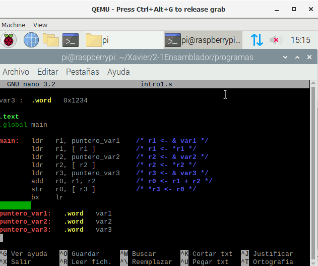
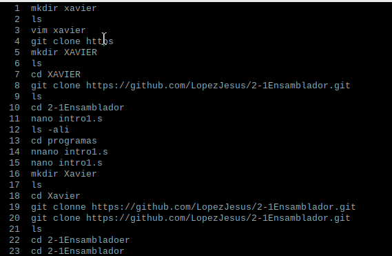
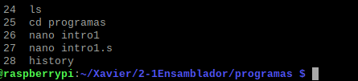

#    Tecnológico Nacional de México
#   Instituto Tecnológico de Tijuana
#        Subdirección Académica

# Departamento de Sistemas y Computación
# Ingeniería en Sistemas Computacionales
# Lenguajes de interfaz 

# Practica Bloque: 2
# Objetivo: Lectura y ejercicios de ARM32 del ebook OpenSource

# López Galaz Jesús Xavier 18212208
   

# Profesor:
# MC. René Solis Reyes
# Semestre sep - ene 2020

# Capitulo 1
## Características generales de la arquitectura ARM
ARM es una arquitectura RISC (Reduced Instruction Set Computer=Ordenador con Conjunto Reducido de Instrucciones) de 32 bits, salvo la versión del core ARMv8-A que es mixta 32/64 bits (bus de 32 bits con registros de 64 bits). Se trata de una arquitectura licenciable, quiere decir que la empresa desarrolladora ARM Holdings diseña la arquitectura, pero son otras compañías las que fabrican y venden los chips, llevándose ARM Holdings un pequeño porcentaje por la licencia.

## Registros
La arquitectura ARMv6 presenta un conjunto de 17 registros (16 principales más uno de estado) de 32 bits cada uno.

**Registros Generales.** Su función es el almacenamiento temporal de datos. Son los
13 registros que van R0 hasta R12.

**Registros Especiales.** Son los últimos 3 registros principales: R13, R14 y R15.
Como son de propósito especial, tienen nombres alternativos

- SP/R13. Stack Pointer ó Puntero de Pila.
- LR/R14. Link Register ó Registro de Enlace.
- PC/R15. Program Counter ó Contador de Programa.

**Registro CPSR.** Almacena las banderas condicionales y los bits de control. Existen 4 banderas y son las siguientes:
- N. Se activa cuando el resultado es negativo.
- Z. Se activa cuando el resultado es cero o una comparación es cierta.
- C. Indica acarreo en las operaciones aritméticas.
- V. Desbordamiento aritmético.

## El lenguaje ensamblador
El ensamblador es un lenguaje de bajo nivel que permite un control directo de la CPU y todos los elementos asociados. 

Presenta una serie de ventajas e inconvenientes con respecto a otros lenguajes de más alto nivel. Al ser un lenguaje de bajo nivel, presenta como principal característica la flexibilidad y la posibilidad de acceso directo a nivel de registro. En contrapartida, programar en ensamblador es laborioso puesto que los programas contienen un número elevado de líneas y la corrección y depuración de éstos se hace difícil. El ensamblador se utiliza como apoyo a otros lenguajes de alto nivel para 3 tipos de situaciones:
- Operaciones que se repitan un número elevado de veces.
- Cuando se requiera una gran velocidad de proceso.
- Para utilización y aprovechamiento de dispositivos y recursos del sistema.

## El entorno
Los pasos habituales para hacer un programa (en cualquier lenguaje) son los
siguientes: 
1. lo primero es escribir el programa en el lenguaje fuente mediante un editor de programas. El resultado es un fichero en un lenguaje que puede entender el usuario, pero no la máquina. 
2. Para traducirlo a lenguaje máquina hay que utilizar un programa traductor. 
3. Éste genera un fichero con la traducción de dicho programa, pero todavía no es un programa ejecutable. Un fichero ejecutable contiene el programa traducido más una serie de códigos que debe tener todo programa que vaya a ser ejecutado en una máquina determinada. Entre estos códigos comunes se encuentran las librerías del lenguaje. El encargado de unir el código del programa con el código de estas librerías es un programa llamado montador (linker) que genera el programa ejecutable

## Aspecto de un programa en ensamblador
La principal característica de un módulo fuente en ensamblador es que existeuna clara separación entre las instrucciones y los datos. La estructura más general de un módulo fuente es:
- **Sección de datos.** Viene identificada por la directiva .data. En esta zona se definen todas las variables que utiliza el programa con el objeto de reservar memoria para contener los valores asignados. 

- **Sección de código.** Se indica con la directiva .text, y sólo puede contener código o datos no modificables.

## Datos
Los datos se pueden representar de distintas maneras. Para representar números tenemos 4 bases. La más habitual es en su forma decimal, la cual no lleva ningún delimitador especial. Luego tenemos otra muy útil que es la representación hexadecimal, que indicaremos con el prefijo *0x.*

## Símbolos
Como las etiquetas se pueden ubicar tanto en la sección de datos como en la de código, la versatilidad que nos dan las mismas es enorme. En la zona de datos, las etiquetas pueden representar variables, constantes y cadenas. En la zona de código podemos usar etiquetas de salto, funciones y punteros a zona de datos

## Instrucciones
- **Instrucciones de transferencia de datos.** Mueven información entre registros y posiciones de memoria. En la arquitectura ARMv6 no existen puertos ya que la E/S está mapeada en memoria. Pertenecen a este grupo las siguientes instrucciones: mov, ldr, str, ldm, stm, push, pop.
- **Instrucciones aritméticas.** Realizan operaciones aritméticas sobre números binarios o BCD. Son instrucciones de este grupo add, cmp, adc, sbc, mul.
- **Instrucciones de manejo de bits.** Realizan operaciones de desplazamiento, rotación y lógicas sobre registros o posiciones de memoria. Están en este grupo las instrucciones: and, tst, eor, orr, LSL, LSR, ASR, ROR, RRX.
- **Instrucciones de transferencia de control.** Se utilizan para controlar el flujo de ejecución de las instrucciones del programa. Tales como b, bl, bx, blx y sus variantes condicionales.

## Directivas
Las directivas son expresiones que aparecen en el módulo fuente e indican al
compilador que realice determinadas tareas en el proceso de compilación. Son fácilmente distinguibles de las instrucciones porque siempre comienzan con un punto.

## Corrida de programas de ensamblador en el QEMU

Estos pasos son aplicables para los programas que fueron utilizados en estos dos capitulos.

# Capitulo 2
## Modos de direccionamiento del ARM
En la arquitectura ARM los accesos a memoria se hacen mediante instrucciones específicas ldr y str (luego veremos las variantes ldm, stm y las preprocesadas push. En la arquitectura ARM los accesos a memoria se hacen mediante instrucciones específicas ldr y str (luego veremos las variantes ldm, stm y las preprocesadas push.

**Direccionamiento inmediato.** El operando fuente es una constante, formando parte de la instrucción.

**Direccionamiento inmediato con desplazamiento o rotación.** Es una variante del anterior en la cual se permiten operaciones intermedias sobre los registros.

**Direccionamiento a memoria, sin actualizar registro puntero.** Es la forma más sencilla y admite 4 variantes. Después del acceso a memoria ningún registro implicado en el cálculo de la dirección se modifica.

**Direccionamiento a memoria, actualizando registro puntero.** En este modo de direccionamiento, el registro que genera la dirección se actualiza con la propia dirección.

## Tipos de datos
Tipos de datos básicos. En la siguiente tabla se recogen los diferentes tipos de datos básicos que podrán aparecer en los ejemplos, así como su
tamaño y rango de representación

- Punteros. Un puntero siempre ocupa 32 bits y contiene una dirección de memoria. En ensamblador no tienen tanta utilidad como en C, ya que disponemos de registros de sobra y es más costoso acceder a las variables a través de los punteros que directamente

- Vectores. Todos los elementos de un vector se almacenan en un único bloque de memoria a partir de una dirección determinada. Los diferentes elementos se almacenan en posiciones consecutivas, de manera que el elemento i está entre los i-1 e i+1.

- Matrices bidimensionales. Una matriz bidimensional de N×M elementos se almacena en un único bloque de memoria. Interpretaremos una matriz de N×M como una matriz con N filas de M elementos cada una. Si cada elemento de la matriz ocupa B bytes, la matriz ocupará un bloque de M ×N ×B bytes.

## Instrucciones de salto
Las instrucciones de salto pueden producir saltos incondicionales (b y bx) o saltos condicionales. Cuando saltamos a una etiqueta empleamos b, mientras que si queremos saltar a un registro lo hacemos con bx. La variante de registro bx la solemos usar como instrucción de retorno de subrutina, raramente tiene otros usos.

## Estructuras de control de alto nivel
Las estructuras for y while se pueden ejecutar un mínimo de 0 iteraciones (si la primera vez no se cumple la condición). Para programar en ensamblador estas estructuras se utilizan instrucciones de salto condicional.

## Bibliografia
Antonio José Villena Godoy. (2014). PRÁCTICAS DE ENSAMBLADOR BASADAS EN RASPBERRY PI. 23 de Octubre del 2020, de UNIVERSIDAD DE MÁLAGA Sitio web: https://riuma.uma.es/xmlui/bitstream/handle/10630/10214/LibroDePracticas.pdf?sequence=1&isAllowed=y

